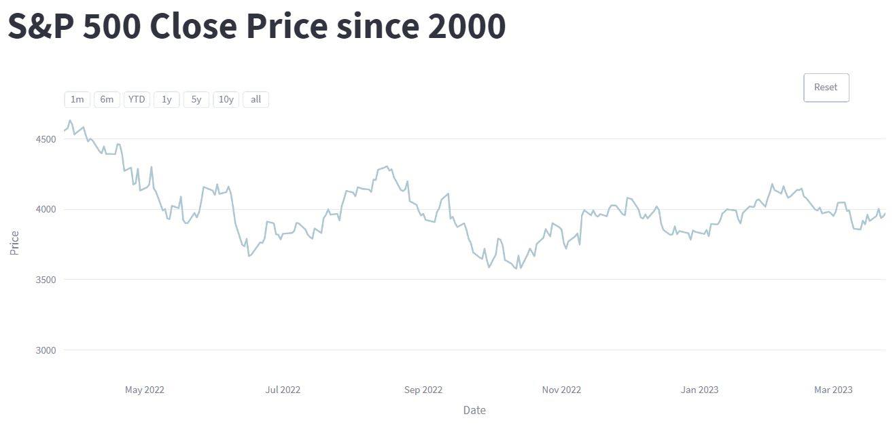
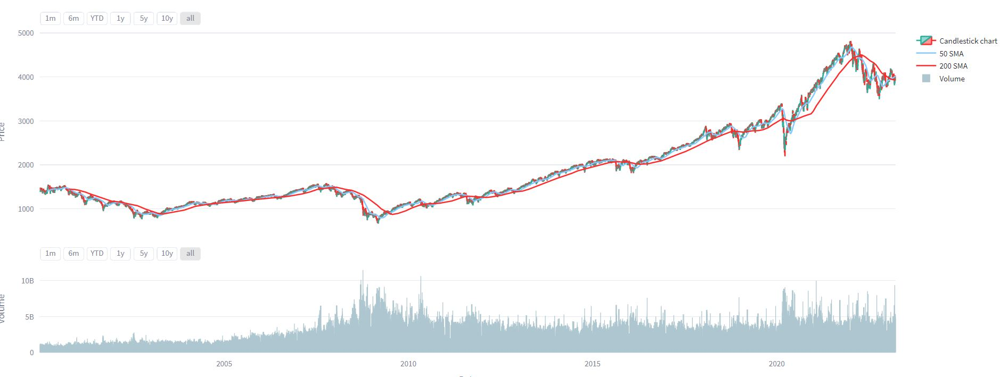
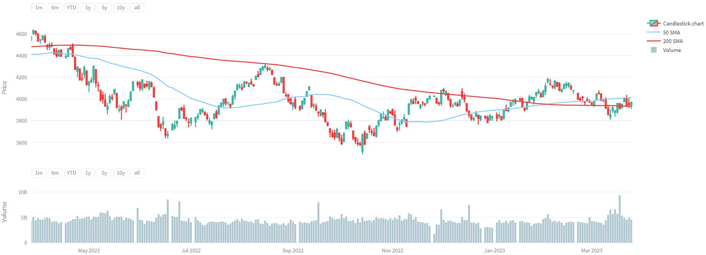
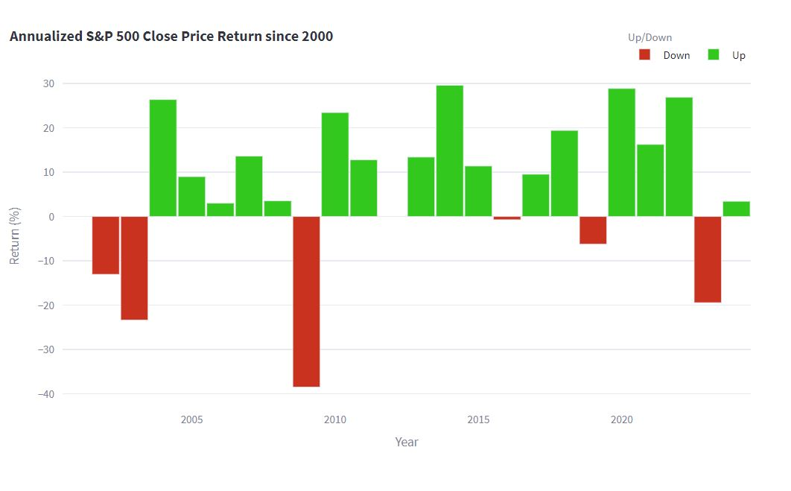
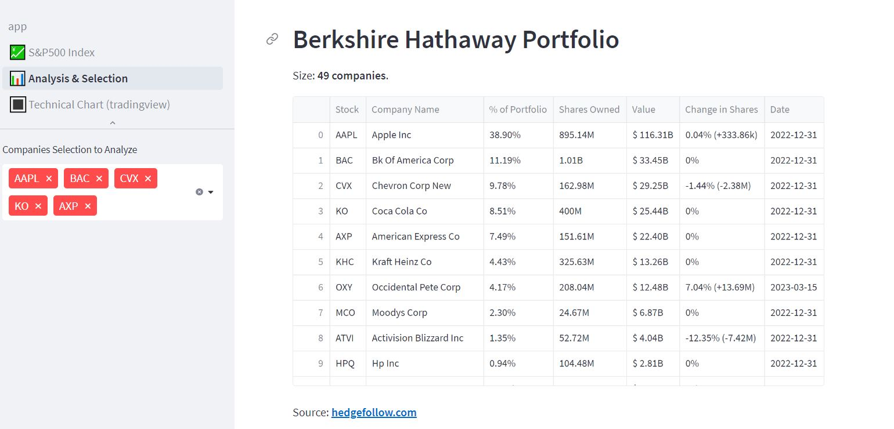
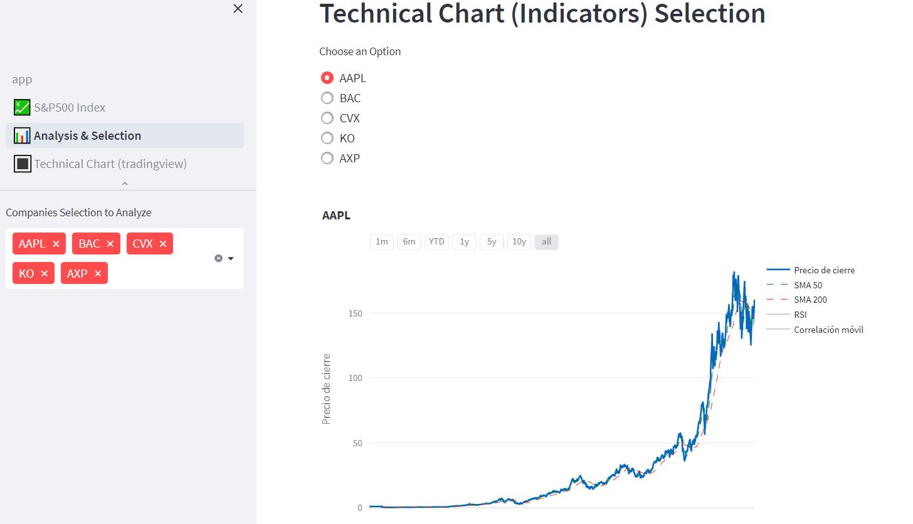
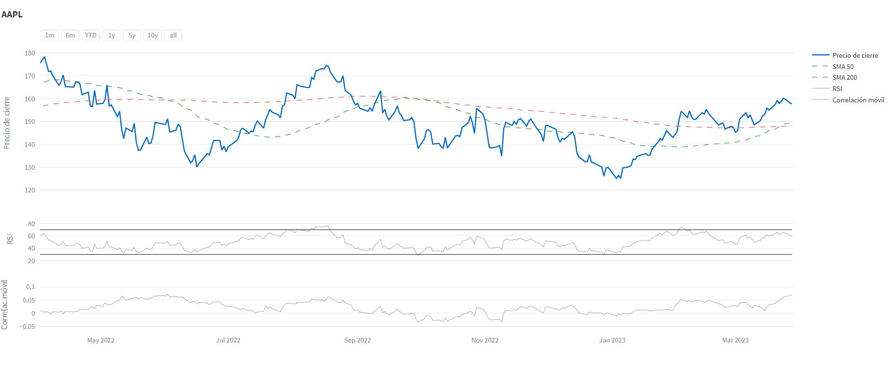
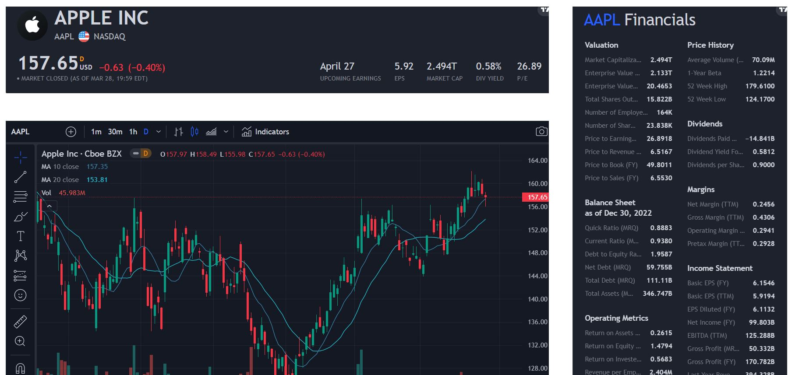

<h1 align='center'>
 <b>PROYECTO: MERCADO BURSÁTIL</b>
</h1>
 

## **INTRODUCCIÓN**

Se propone la situación donde una empresa busca invertir en el mercado bursátil y solicita un análisi en detalle. Considerando que la empresa no conoce esta área financiera, solicita una explicación de qué ha sucedido en este mercado en los últimos años (considerando impactos positivos y negativos a partir del año 2000), recomendaciones de inversión (ya sea enfocada en empresas o rubros de éstas) y cualquier otra información complementaria que nos resulte significativa.

## **DESARROLLO**

🔸 Comenzaremos obteniendo la información usando la biblioteca para Python **[yfinance](https://pypi.org/project/yfinance/)**.

🔸 Asimismo obtendremos información detallada sobre la composición el índice **[S&P 500](https://en.wikipedia.org/wiki/List_of_S%26P_500_companies)** para comenzar nuestro análisis.

🔸 Realizaremos un **Análisis Exploratorio de Datos (EDA)** analizando los campos y registros obtenidos, eliminando aquellos que no serán necesarios para nuestro trabajo, verificando valores duplicados y valores nulos, patrones, relaciones, etc.

🔸 Desarrollaremos un **herramienta gráfica** en Streamlit con el fin de brindar soporte a nuestro storytelling.

🔸 Explicaremos los motivos de las princpales variaciones del S&P 500 y porqué consideramos que es un buen punto de partida para comenzar nuestro análisis de recomendación de inversiones.

🔸 Demostraremos las herramientas que utlizaremos para efectuar los Análisis Fundamental y Técnico que servirán para seleccionar las acciones.

🔸 Finalmente trabajaremos con **KPI'S** que nos brindarán información final sobre los papeles de acciones que serán recomendados. 

## **Arbol del proyecto:**
 
│
├─── **data:** almacén de archivos .csv (datasets).  
│       ├───berkshire_porfolio.csv   
│       └───sp500_data.csv                          
│       └───sp500_index.csv                          
│───**images:** Almacén de imágenes.    
├───**pages** páginas de la presentación en Streamlit.   
│       ├───01_💹_S&P500_Index.py   
│       └───02_📊_Analysis_&_Selection.py                  
│       └───03_🔳_Technical_Chart_(tradingview).py        
└───**app.py:** Archivo principal de Streamlit       
└───**EDA_principal.ipynb:** Análisis exploratorio         
└───**Readme.md:** archivo de presentación del prouyecto  
└───**utility_hedgefollow.ipynb:** Utilidad para Web Scrapping 
   

